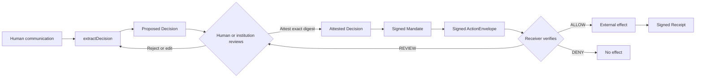
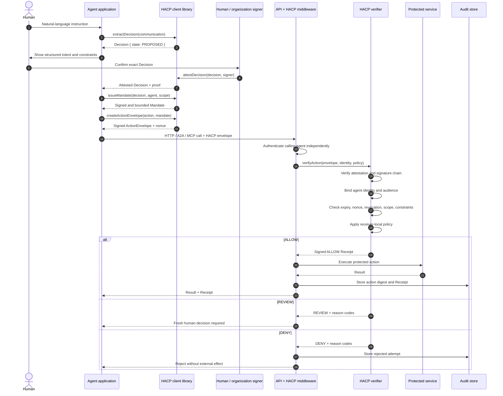

# HACP — Human–Agent Coordination Protocol

[](https://github.com/ahi-lab-hacp/hacp/actions/workflows/ci.yml)
[](LICENSE)
[](https://ahi-lab.com/hacp)

HACP is an authorization and provenance layer that makes consequential agent actions traceable to a human or institutional decision.

Agent authentication answers **which software is making a request**. Conventional authorization answers **whether that software has a credential or scope**. HACP answers the missing questions:

- Who decided this action should happen?
- What exactly did they authorize?
- Which agent received that authority?
- What constraints and expiry apply?
- Does the proposed external effect remain inside those bounds?
- Can an independent auditor verify the chain later?

The protocol is transport-neutral. It can accompany HTTP calls, A2A messages, MCP tool calls, queues, or organization-internal RPC.

> **Core guarantee:** every accepted agent action can be connected to explicit, bounded, and verifiable human authority.

## Positioning

HACP is a **generic, cross-platform provenance protocol for agent actions**. It is not tied to one model provider, agent framework, transport, organization, or application domain. The same Decision, Mandate, ActionEnvelope, and Receipt model can protect commerce, software changes, infrastructure operations, communications, data access, and other consequential actions.

HACP is designed to compose with the existing agent and web security stack rather than replace it:

- Authentication such as Web Bot Auth, OAuth, mTLS, or workload identity establishes **which agent is calling**.
- Transports such as HTTP, MCP, A2A, queues, and internal RPC carry the request.
- HACP establishes **which human or institution authorized the action, what they decided, which constraints apply, and whether the concrete action remains within that authority**.
- Receiver-local policy determines whether that independently authenticated and provenance-backed action is accepted.

This separation makes HACP portable across platforms and verifiable across organizational boundaries. An agent can create a HACP authorization chain in one system, carry it through another agent or transport, and present it to an independent service without requiring that service to trust the agent's private reasoning or its claim of good intent.

Protocol specification: [ahi-lab.com/hacp](https://ahi-lab.com/hacp)

Repository specification: [`specification/hacp.md`](specification/hacp.md) ·
[Standardization and adoption plan](STANDARDIZATION.md) ·
[Implementation registry](IMPLEMENTERS.md)

## Why HACP is needed

Today, a website usually sees an agent as just another HTTP client. Consider an airline ticket website receiving two nearly identical booking requests. One may come from a trusted travel agent that Alice asked to book a Friday flight to New York for no more than $600. The other may come from an attacker-controlled agent attempting stolen-card purchases, inventory abuse, or thousands of unwanted reservations. Authentication can identify the software making each request, but it does not prove which human authorized the booking, what that person intended, or whether the selected flight and price remain within their instructions.

HACP gives the legitimate request a verifiable chain: Alice's reviewed decision, the exact limits she approved, the identity of the agent she authorized, and the concrete booking action the agent proposes. The ticket website verifies that chain and applies its own policy before creating the reservation. It can accept a properly authorized booking, request human review when the evidence is insufficient, or deny an anonymous, altered, expired, replayed, or out-of-scope request. HACP does not ask the website to trust an agent's claim that its intentions are good; it gives the website evidence it can verify and control.

## The trust boundary

Natural-language extraction is probabilistic. Authorization must not be.

`extractDecision()` produces a `PROPOSED` Decision and **cannot authorize an action**. Authority begins only when an accepted human or institutional signer attests the exact canonical Decision. A verifier must also authenticate the calling agent independently and bind that identity to both `ActionEnvelope.agent` and `Mandate.subject`.



## End-to-end workflow



## Protocol objects

| Object | Purpose | Signed by |
| --- | --- | --- |
| `Decision` | Structured intent, constraints, evidence commitments, and provenance | Human, institution, or accepted attester |
| `Mandate` | Audience-bound, time-limited authority delegated to a named agent | Principal, institution, or authorized parent agent |
| `ActionEnvelope` | The concrete external effect the agent proposes | Authenticated acting agent |
| `Receipt` | The verifier's `ALLOW`, `DENY`, or `REVIEW` verdict and policy version | Receiving verifier |
| `RevocationRecord` | Append-only withdrawal of future authority | Authorized issuer |

The provenance graph is:

```text
Human communication
        │ evidence commitment
        ▼
Attested Decision ──► Mandate ──► ActionEnvelope ──► Receipt
                          │                              ▲
                          └── delegated Mandate(s) ─────┘
                                     │
                              RevocationRecord
```

## Reference integration: Cofeat

[Cofeat](https://github.com/edieYoung/educated/pull/17) is the first end-to-end, cross-service HACP integration. An explicit Slack action creates an attested Decision for the verified Slack member and a narrow, expiring Mandate for the separately deployed Cofeat Slack agent. The agent signs the exact design-generation ActionEnvelope and sends it over the HACP HTTP binding.

The Cofeat API independently authenticates the Slack service, verifies the agent and authority signatures, audience, permission, target, feature/channel constraints, expiration, and nonce, then applies its local policy. Only an `ALLOW` Receipt reaches the model provider. Altered actions and replays are denied before any model call, and every verification attempt is retained with its signed Receipt.

This integration demonstrates the intended composition:

```text
Slack identity + explicit click   HACP provenance                 API policy
            │                          │                              │
            └─ Decision → Mandate → signed ActionEnvelope → verify ──┤
                                                                      ▼
                                                           effect + Receipt
```

The service bearer token remains mandatory. It authenticates the calling workload; HACP binds that workload to the human decision authorizing the concrete action.

## Packages

| Package | Responsibility |
| --- | --- |
| `@ahi-lab-hacp/core` | Canonicalization, Ed25519 proofs, Decisions, Mandates, delegation, constraints, replay protection, revocation, verification, and Receipts |
| `@ahi-lab-hacp/http` | Fetch-compatible request encoding, parsing, verification responses, and server middleware |
| `@ahi-lab-hacp/cli` | Key generation, canonicalization, digests, and Receipt verification |

HACP is language-neutral. TypeScript is the 0.1 reference implementation, followed by Python and Go. Every implementation must pass the same published conformance vectors; matching TypeScript interfaces alone is not interoperability. See the [language support policy](docs/language-support.md).

## Install

Packages are published under the `@ahi-lab-hacp` npm scope. During repository development:

```bash
pnpm install
pnpm check
```

## Quick start

### 1. Extract a non-authoritative decision proposal

HACP does not prescribe a model provider. Supply an extraction adapter and preserve which fields were asserted by a human versus inferred by a model.

```ts
import { extractDecision } from "@ahi-lab-hacp/core";

const proposal = await extractDecision({
  communication: "Buy a Friday afternoon flight to NYC for no more than $600.",
  principal: {
    id: "did:web:acme.example:users:alice",
    type: "HUMAN",
    organization: "did:web:acme.example",
  },
  extractor: myModelAdapter,
  source: "slack://travel/17123",
});

// proposal.state === "PROPOSED"
// This object carries provenance, but no authority yet.
```

### 2. Attest the exact decision and issue a bounded mandate

```ts
import { attestDecision, issueMandate } from "@ahi-lab-hacp/core";

// Show the canonical Decision to Alice before calling this function.
const decision = attestDecision({
  decision: proposal,
  signer: aliceSigner,
  method: "DIRECT_CONFIRMATION",
  assuranceLevel: "HACP_L2",
});

const mandate = issueMandate({
  decision,
  issuer: decision.principal.id,
  subject: "did:web:agents.acme.example:travel",
  signer: aliceSigner,
  permissions: ["flight.purchase"],
  constraints: {
    destination: ["NYC"],
    maxAmount: { currency: "USD", value: "600.00" },
  },
  audience: ["https://api.example-air.com"],
  notAfter: "2026-09-14T07:00:00.000Z",
});
```

### 3. Sign and attach the concrete action

```ts
import { createActionEnvelope } from "@ahi-lab-hacp/core";
import { createHacpRequest } from "@ahi-lab-hacp/http";

const envelope = createActionEnvelope({
  mandate,
  agent: "did:web:agents.acme.example:travel",
  signer: agentSigner,
  action: {
    type: "flight.purchase",
    target: "https://api.example-air.com/flights/UA123",
    parameters: {
      destination: "NYC",
      amount: { currency: "USD", value: "542.00" },
    },
  },
});

const response = await fetch(
  createHacpRequest(envelope.action.target, {
    method: "POST",
    envelope,
  }),
);
```

The HTTP binding sends `Content-Type: application/hacp+json` and `HACP-Version: 0.1`. Other bindings can carry the same canonical envelope without changing authorization semantics.

### 4. Verify at the server boundary

```ts
import { InMemoryNonceStore } from "@ahi-lab-hacp/core";
import { createHacpHandler } from "@ahi-lab-hacp/http";

const handler = createHacpHandler({
  // This must come from mTLS, OAuth, workload identity, or another
  // independent authentication mechanism—not from the HACP body.
  authenticateAgent: authenticateRequest,

  resolveDecision,
  resolveMandate,
  resolveKey,
  authorizeVerificationMethod,
  revocations,
  nonces: new InMemoryNonceStore(), // Use a durable atomic store in production.
  verifier: "did:web:api.example-air.com:hacp",
  receiptSigner,
  policy: {
    version: "air-api/hacp-policy@3",
    evaluate: async ({ decision, action }) => localRiskPolicy(decision, action),
  },

  onAllow: async ({ verification }) => {
    const result = await performProtectedEffect(verification.action);
    return Response.json({ result, receipt: verification.receipt });
  },
});
```

Run the complete example:

```bash
pnpm --filter @hacp-example/basic start
```

## Runnable examples

| Example | What it demonstrates | Run |
| --- | --- | --- |
| [`examples/basic`](examples/basic) | Smallest complete Decision → Mandate → ActionEnvelope → Receipt flow | `pnpm --filter @hacp-example/basic start` |
| [`examples/ticket-booking`](examples/ticket-booking) | Human-language extraction, HTTP binding, independent agent authentication, price/scope enforcement, tamper detection, replay protection, and signed receipts | `pnpm --filter @hacp-example/ticket-booking start` |

The ticket-booking demo intentionally sends one valid request and four invalid requests, making the protocol's security boundaries visible in a single console table.

## Verification order

A conforming verifier fails closed and checks:

1. Protocol version, object type, canonical form, and action signature.
2. Independent transport identity against the envelope's agent identity.
3. Decision attestation and the signer's authority for the principal.
4. Every Mandate signature and every link in the delegation chain.
5. Monotonic attenuation of permissions, audience, validity, constraints, and delegation depth.
6. Audience, timestamps, expiry, nonce freshness, and revocation status.
7. The resolved action type, target, and parameters against the effective constraints.
8. Receiver-local issuer trust, assurance, risk, and business policy.
9. Atomic nonce consumption and a signed Receipt before or with the external effect.

Unknown or non-machine-evaluable critical constraints return `REVIEW` or `DENY`; they never silently pass.

## Repository layout

```text
hacp/
├── packages/
│   ├── core/              # TypeScript reference implementation
│   ├── http/              # Fetch-compatible HTTP binding
│   └── cli/               # Developer and audit tooling
├── specification/
│   └── schema/            # Language-neutral JSON Schema
├── conformance/
│   └── vectors/           # Cross-language canonical test vectors
├── examples/
│   ├── basic/             # Minimal agent → server workflow
│   └── ticket-booking/    # Runnable allow/deny security demonstration
├── docs/                  # Architecture, threat model, and integrations
└── .github/               # CI and contribution templates
```

## Security

HACP carries authorization evidence; incorrect integrations can create real-world effects. Before production use:

- use hardware-backed or managed signing keys;
- authenticate agents independently of the envelope;
- implement atomic, durable nonce storage;
- resolve revocation status with an explicit freshness policy;
- use domain-specific constraint evaluators for every critical constraint;
- execute the protected effect only after an `ALLOW` Receipt;
- obtain an independent security review.

Report vulnerabilities privately as described in [SECURITY.md](SECURITY.md). Do not open public issues for suspected vulnerabilities.

## Development

```bash
pnpm install
pnpm format:check
pnpm lint
pnpm typecheck
pnpm test
pnpm build
```

Changes that affect canonical bytes, proof construction, verification order, or authorization meaning require conformance vectors and a protocol compatibility review.

## Governance and roadmap

HACP is stewarded by the `ahi-lab-hacp` organization and welcomes implementers from outside AHI.lab. See [GOVERNANCE.md](GOVERNANCE.md), [CONTRIBUTING.md](CONTRIBUTING.md), and [ROADMAP.md](ROADMAP.md).

## License

Apache License 2.0. See [LICENSE](LICENSE).
