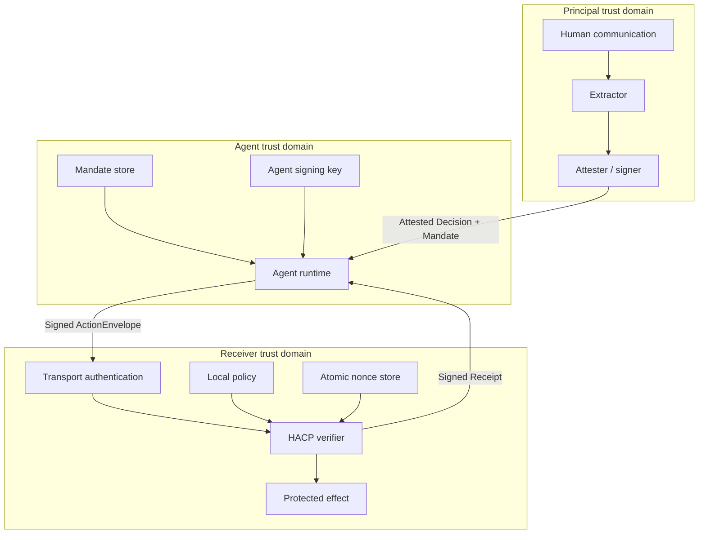

# Architecture

HACP separates five concerns that are often collapsed inside an agent prompt:

1. **Interpretation** — an extractor proposes structured intent and constraints from human communication.
2. **Authority** — an accepted attester binds a principal to the exact canonical Decision.
3. **Delegation** — a Mandate gives a named agent limited permissions, audience, validity, and delegation depth.
4. **Enforcement** — a receiver authenticates the agent independently and verifies the proposed effect.
5. **Audit** — signed Receipts preserve the decision made under a specific policy version.

## Trust domains

No single component is trusted to invent authority:

- The Extractor can propose but cannot attest.
- The Agent can select an action but cannot widen its Mandate.
- The transport identity alone does not prove human intent.
- The Verifier uses its own trust anchors and policy; it does not accept the sender's policy conclusions.

## Core invariants

- Signed objects are canonicalized before hashing and signing.
- A `PROPOSED` Decision has no authorization effect.
- Material changes to an attested Decision require a new Decision identifier and attestation.
- Every child Mandate is equal to or narrower than its parent.
- Root Mandate permissions match the controlling signed intent type.
- The authenticated caller equals both the ActionEnvelope agent and final Mandate subject.
- The receiving origin is in the final Mandate audience.
- Action nonces are consumed atomically within their scope.
- Unknown critical authorization semantics fail closed.
- Historical Receipts are append-only; revocation changes future authority, not past facts.

## Extension points

The reference implementation requires applications to provide:

- `DecisionExtractor` for model- or rules-based extraction;
- `KeyResolver` and `VerificationMethodAuthorizer` for identity infrastructure;
- object resolvers for Decisions and Mandates;
- `RevocationResolver` and durable `NonceStore` implementations;
- `IntentEvaluator` and `ConstraintEvaluator` for domain-specific effects;
- `VerificationPolicy` for receiver-local risk and business rules.

These interfaces keep the protocol independent of model provider, identity scheme, database, transport, and application domain.
