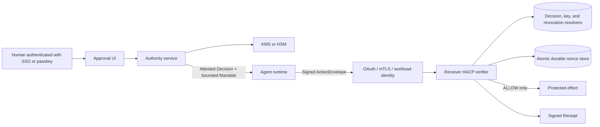

# Production deployment boundary

HACP is secure only when human approval, Agent execution, and receiver
enforcement are separate trust boundaries. The model may prepare objects, but it
must not possess human authority keys or bypass the receiver verifier.



## 1. Human approval service

The approval service must authenticate the human or institutional approver,
display the exact intent and constraints, and create a short-lived, one-time
approval grant bound to the exact proposed Decision digest. The authority
service consumes that grant with `attestApprovedDecisionWithProvider()` and
then issues a narrowly scoped Mandate with `issueMandateWithProvider()`.

`ApprovalGrantStore.consume()` must be atomic. The grant records the principal,
authentication method, approval and expiry times, and exact Decision digest;
an expired, reused, differently authenticated, or mismatched grant cannot
attest a Decision.

The Agent runtime receives the resulting signed objects. It must not receive:

- the authority private key;
- KMS credentials capable of arbitrary signing;
- an approval-session cookie;
- an endpoint that signs without checking an authenticated approval record;
- permission to change the Decision after approval.

The `SigningProvider` callback is the integration point for KMS, HSM, passkey,
or a separately deployed authority service. The provider should allow only the
expected HACP proof purpose, controller, object digest, and current approved
workflow.

## 2. Agent execution

The Agent signs only the concrete ActionEnvelope. The envelope signature covers
the Mandate reference, Agent identity, action type, target, parameters, nonce,
and creation time. The Agent key should be a workload key rather than a human
authority key.

If the Agent proposes a materially different action, it must obtain a new
Decision and Mandate from the approval service. It cannot convert a failed
intent or constraint check into `ALLOW`.

## 3. Independent Agent authentication

The receiver must authenticate the calling workload before reading identity
from HACP. Use validated OAuth access-token claims, mTLS client identity, or a
cloud workload-identity assertion. Never treat a bearer header containing a
plain Agent identifier as production authentication.

```ts
const handler = requireHacp({
  authenticateAgent: async (request) => {
    const claims = await verifyOAuthAccessToken(request);
    return {
      id: claims.agent_id,
      method: "OAUTH2_PRIVATE_KEY_JWT",
      credentialId: claims.jti,
    };
  },
  // verification dependencies and onAllow follow
});
```

The normalized authentication metadata is available to `onAllow` for the
receiver audit record. HACP still compares its `id` to both the ActionEnvelope
Agent and the leaf Mandate subject.

## 4. Intent and effect verification

Before invoking the protected operation, the receiver verifies:

1. the independently authenticated Agent identity;
2. Decision, Mandate, and ActionEnvelope proofs;
3. proof-to-controller authorization and key status;
4. exact intent type and machine-readable intent parameters;
5. permissions, audience, validity, revocation, and delegation attenuation;
6. domain constraints such as quantity, currency, price, destination, and target;
7. a one-time nonce through atomic durable storage;
8. receiver-local fraud, safety, and business policy.

Unknown intent or constraint semantics must produce `REVIEW` or `DENY`, never
`ALLOW`.

## 5. Durable replay protection

`DurableNonceStore` delegates nonce consumption to a production database. Its
`consumeIfAbsent` operation must atomically insert a uniqueness key for
`(scope, nonce)` and return `false` when the key already exists.

```ts
const nonces = new DurableNonceStore({
  consumeIfAbsent: ({ scope, nonce, expiresAt }) =>
    database.insertNonceIfAbsent({ scope, nonce, expiresAt }),
});
```

For SQL, enforce a unique primary key over `(scope, nonce)` and use one
`INSERT ... ON CONFLICT DO NOTHING` operation. For Redis-compatible stores, use
one `SET key value NX PX` operation. A read followed by a write is not atomic and
is not conforming replay protection.

## 6. Rotation and revocation

`VerificationMethodRegistry` keeps retired public keys resolvable for proofs
created during their active interval. A retired key may validate historical
objects; a key marked `revokedAt` is rejected after compromise.

`VerifiedRevocationResolver` validates every revocation signature, binds the
verification method to its issuer, and calls deployment policy to determine
whether that issuer may revoke the referenced object. Store revocation records
durably and make resolver failure fail closed.

Use distinct keys for:

- human or institutional Decision attestation and root Mandates;
- Agent ActionEnvelopes;
- receiver Receipts;
- separate organizations or tenants where compromise isolation matters.

## 7. Effect transaction

Verification and the external effect must share an idempotency or transaction
boundary. After `ALLOW`, persist the nonce, Receipt, and business operation so a
retry cannot create a second effect. Re-resolve mutable values such as final
price immediately before execution and reject any time-of-check/time-of-use
change.

## Deployment checklist

- Human confirmation occurs outside the model runtime.
- Authority keys are non-exportable and unavailable to the Agent.
- Agent authentication is independently verified.
- Intent and every consequential parameter are machine-evaluable.
- Unknown semantics fail closed.
- Nonces are consumed atomically across every receiver replica.
- Key status and revocations are checked online or through bounded-fresh caches.
- The HACP gateway is the only path to the protected effect.
- `ALLOW` Receipt, nonce, and effect are linked transactionally.
- The deployment has threat modeling, monitoring, and an independent security review.
