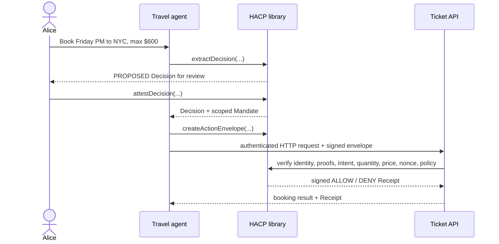

# HACP ticket-booking demo

[Run the live interoperability demonstration](https://hacp-ticket-demo-dmy3rfwd7q-uw.a.run.app) ·
[Inspect its public HACP discovery document](https://hacp-ticket-demo-dmy3rfwd7q-uw.a.run.app/.well-known/hacp.json)

This runnable example shows why authentication alone is insufficient for agent traffic. A ticket API can authenticate a travel agent, but it still needs to know which person authorized the booking, the price and destination limits they approved, and whether the request was modified or replayed.

The demo uses the public APIs from `@ahi-lab-hacp/core` and `@ahi-lab-hacp/http`:



## Run it

From the repository root:

```bash
pnpm install
pnpm --filter @hacp-example/ticket-booking start
```

The output shows six requests:

| Scenario | Expected result | Why |
| --- | --- | --- |
| Wrong authenticated agent | `DENY` | Transport identity does not match the signed agent identity |
| Price above $600 | `DENY` | The concrete action exceeds Alice's mandate |
| Request for 100 tickets | `DENY` | The concrete quantity contradicts Alice's signed one-ticket intent |
| Destination changed after signing | `DENY` | The ActionEnvelope signature no longer verifies |
| Authorized $542 NYC booking | `ALLOW` | Identity, provenance, scope, constraints, and policy all pass |
| Replay of the allowed request | `DENY` | The one-time action nonce has already been consumed |

Every response contains a verifier-signed Receipt, including denials. The example validates every Receipt signature before displaying the result.

## Run the interactive server

```bash
pnpm --filter @hacp-example/ticket-booking serve
```

Open `http://localhost:8787`. The page begins with the valid booking and lets
you switch between all six cases. Its under-the-hood view follows one request
through seven verification gates and exposes the natural-language source,
signed Decision, delegated Mandate, authenticated HTTP request, server check
report, and signed Receipt. The server exposes:

- `GET /` — interactive demonstration;
- `POST /api/demo` — machine-readable, complete signed run;
- `GET /.well-known/hacp.json` — public identities, keys, algorithms, and accepted action;
- `GET /api/health` — deployment health check.

The process creates one independent key pair for the human, agent, and ticket
receiver at startup. Only public material is included in discovery and demo
responses. Restarting the reference server intentionally rotates these
ephemeral demonstration keys.

## Follow the implementation

Read [`src/demo.ts`](./src/demo.ts) in numbered sections:

1. `extractDecision()` creates a non-authoritative proposal from natural language.
2. `attestDecision()` and `issueMandate()` bind human approval to a named agent and constraints.
3. `createActionEnvelope()` signs the exact proposed purchase.
4. `createHacpRequest()` carries it over HTTP alongside independent authentication.
5. `createHacpHandler()` verifies the chain and runs the ticket site's local policy.

The example uses in-memory keys and stores for clarity. Production systems should use managed signing keys, durable object resolution, atomic shared nonce storage, revocation checks, and real workload authentication. No real booking or external side effect occurs in this demonstration.
